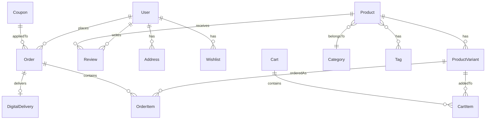

# Data Models & Schema Design

Database entities and their relationships for LogaShop. Part of the [Developer Guide](README.md).

---


## Entity Relationship Overview



- **Product images** are embedded in `Product` as `images[]` (no separate ProductImage collection).
- **Order payment** is stored on `Order` (paymentIntentId, paidAt, paymentStatus, paymentMethod). No separate Payment model; all payments flow through Order checkout.

---

## Core Models

### 1. User

```javascript
User {
  _id: ObjectId,
  email: String (unique),
  password: String (hashed, select: false),
  googleId: String (unique, sparse),
  name: String,
  role: 'admin' | 'manager' | 'user',
  status: 'active' | 'inactive' | 'suspended',
  phone: String,
  avatar: String,
  bio: String,

  technicalDetails: { domainName, serverIP, serverUser, serverPassword, serverPort },
  preferences: {
    emailNotifications: Boolean,
    pushNotifications: Boolean,
    notificationFrequency: 'immediate' | 'daily' | 'weekly',
    theme: 'light' | 'dark' | 'system',
    language: String,
    dateFormat: String,
    profileVisibility: 'public' | 'private'
  },

  lastPasswordChange: Date,
  lastLogin: Date,
  accountDeactivatedAt: Date,
  accountDeletedAt: Date,
  dataExportRequests: [{ requestedAt, exportedAt, format: 'json' | 'csv' }],

  fcmTokens: [{ token, device: 'web'|'ios'|'android', browser, createdAt, lastUsed }],
  resetPasswordToken: String,
  resetPasswordExpires: Date,

  createdAt: Date,
  updatedAt: Date
}
```

### 2. Address

```javascript
Address {
  _id: ObjectId,
  userId: ObjectId (ref: User, required),

  label: String,           // e.g. "Home", "Office"
  firstName: String,
  lastName: String,
  company: String,
  address1: String,
  address2: String,
  city: String,
  state: String,
  zipCode: String,
  country: String (default "US"),
  phone: String,
  isDefault: Boolean,

  createdAt: Date,
  updatedAt: Date
}
```

---

## Product Models

### 3. Category

```javascript
Category {
  _id: ObjectId,
  name: String,
  slug: String (unique),
  description: String,
  image: String,

  parentId: ObjectId (ref: Category, nullable),
  ancestors: [{ _id: ObjectId, name: String, slug: String }],  // denormalized for hierarchy
  level: Number (0 = root),

  isActive: Boolean,
  sortOrder: Number,

  metaTitle: String,
  metaDescription: String,

  createdAt: Date,
  updatedAt: Date
}
```

### 4. Product

```javascript
Product {
  _id: ObjectId,
  vendorId: ObjectId (ref: User, optional, multi-vendor ready),

  name: String,
  slug: String (unique),
  sku: String (unique),
  description: String,
  shortDescription: String,

  productType: 'physical' | 'digital' | 'bundle',
  categoryId: ObjectId (ref: Category),
  tags: [String],           // Normalized; synced to Tag collection for autocomplete & unification
  brand: String,

  basePrice: Number (cents),
  salePrice: Number,
  salePriceStart: Date,
  salePriceEnd: Date,

  status: 'draft' | 'active' | 'archived',
  isFeatured: Boolean,

  trackInventory: Boolean,
  stockQuantity: Number,
  lowStockThreshold: Number,
  allowBackorder: Boolean,

  weight: Number (grams),
  dimensions: { length, width, height, unit: 'cm' | 'in' },

  digitalFile: { url, fileName, fileSize, downloadLimit, expiryDays },

  options: [{ name: String, values: [String] }],   // e.g. Color, Size

  images: [{ url, alt, isPrimary, sortOrder }],     // embedded, no separate collection

  metaTitle: String,
  metaDescription: String,

  totalSold: Number,
  averageRating: Number,
  reviewCount: Number,

  deletedAt: Date (soft delete),

  createdAt: Date,
  updatedAt: Date
}
```

### 5. ProductVariant

```javascript
ProductVariant {
  _id: ObjectId,
  productId: ObjectId (ref: Product),

  sku: String (unique),
  attributes: Map (String -> String),   // e.g. { "Color": "Red", "Size": "M" }

  price: Number (null = use product basePrice),
  salePrice: Number,
  stockQuantity: Number,
  weight: Number,
  image: String,

  isActive: Boolean,

  createdAt: Date,
  updatedAt: Date
}
```

(Product images are embedded in **Product** as `images[]`; there is no separate ProductImage model.)

### 5a. Tag

Tags live in their own collection for **autocomplete, spelling consistency, and unifying related items**. Product `tags: [String]` are normalized and synced to Tag on create/update.

```javascript
Tag {
  _id: ObjectId,
  name: String (lowercase, trimmed),
  slug: String,
  postType: 'product' | 'post' | 'portfolio',  // Future: blog, portfolio, etc.
  createdAt: Date,
  updatedAt: Date
}
```

- **Unique:** `(name, postType)` — e.g. `"premium"` can exist for products and blog posts separately.
- **Sync:** On product save, `Tag.syncTags(tags, 'product')` upserts each tag.
- **API:** `GET /api/tags?search=xxx&postType=product` — returns tag names for autocomplete.
- **Component:** `TagsInputField` (Formik) supports `postType` prop; fetches suggestions from API.
- **Seed:** `npm run seed:tags` populates Tag from existing product tags.

---

## Order Models

### 6. Cart

```javascript
Cart {
  _id: ObjectId,

  userId: ObjectId (ref: User, nullable),
  sessionId: String (nullable, for guest carts),

  items: [{
    productId: ObjectId (ref: Product),
    variantId: ObjectId (ref: ProductVariant, nullable),
    quantity: Number (1-99),
    priceSnapshot: Number (cents, at time of add)
  }],

  subtotal: Number (calculated on save),
  itemCount: Number (calculated on save),

  createdAt: Date,
  updatedAt: Date
}
```

### 7. Order

```javascript
Order {
  _id: ObjectId,
  orderNumber: String (unique, auto: "LSYYMM-XXXXX"),

  userId: ObjectId (ref: User, nullable),
  guestEmail: String,
  trackingCode: String (unique, sparse; auto for guest orders),

  items: [{
    productId: ObjectId,
    variantId: ObjectId,
    name: String,
    slug: String,
    sku: String,
    image: String,
    price: Number (cents),
    quantity: Number,
    variantInfo: Mixed,
    lineTotal: Number
  }],

  shippingAddress: { firstName, lastName, company, address1, address2, city, state, zipCode, country, phone },
  billingAddress: (same shape),
  billingSameAsShipping: Boolean,

  subtotal: Number,
  shippingCost: Number,
  taxAmount: Number,
  discount: Number,
  discountDetails: { code, type: 'percentage'|'fixed', value },
  total: Number,

  shippingMethod: 'standard' | 'express' | 'overnight' | 'pickup',
  shippingMethodLabel: String,

  status: 'pending_payment' | 'processing' | 'confirmed' | 'shipped' | 'delivered' | 'cancelled' | 'refunded',
  paymentStatus: 'pending' | 'paid' | 'failed' | 'refunded' | 'partially_refunded',
  paymentMethod: 'stripe' | 'paypal' | 'cod' | 'bank_transfer',
  paymentIntentId: String (Stripe),
  paidAt: Date,

  customerNote: String,
  adminNote: String,

  confirmedAt: Date,
  shippedAt: Date,
  deliveredAt: Date,
  cancelledAt: Date,

  createdAt: Date,
  updatedAt: Date
}
```

Order payment is stored on **Order** (paymentIntentId, paidAt, paymentStatus, paymentMethod). No separate Payment model; all payments flow through Order checkout.

### 8. DigitalDelivery

```javascript
DigitalDelivery {
  _id: ObjectId,
  orderId: ObjectId (ref: Order),
  userId: ObjectId (ref: User),
  productId: ObjectId (ref: Product),
  variantId: ObjectId (ref: ProductVariant, nullable),

  downloadToken: String (unique),
  downloadCount: Number,
  maxDownloads: Number (null = unlimited),
  expiresAt: Date (null = never),

  status: 'active' | 'revoked' | 'expired',

  fileName: String,
  fileUrl: String,

  createdAt: Date,
  updatedAt: Date
}
```

---

## Shipping & Tax

### 9. ShippingZone

```javascript
ShippingZone {
  _id: ObjectId,

  name: String,
  countries: [String] (ISO alpha-2),
  states: [String] (optional, within countries),

  methods: [{
    methodId: 'standard' | 'express' | 'overnight' | 'pickup',
    label: String,
    description: String,
    price: Number (cents),
    freeThreshold: Number (null = never free),
    estimatedDays: String,
    isActive: Boolean
  }],

  isDefault: Boolean (fallback zone),
  isActive: Boolean,
  sortOrder: Number,

  createdAt: Date,
  updatedAt: Date
}
```

### 10. TaxRate (Future)

```javascript
TaxRate {
  _id: ObjectId,

  name: String,
  country: String,
  state: String,
  rate: Number (percentage),

  isCompound: Boolean,
  isActive: Boolean,

  createdAt: Date,
  updatedAt: Date
}
```

---

## Promotions

### 11. Coupon

```javascript
Coupon {
  _id: ObjectId,

  code: String (unique, uppercase),
  description: String,

  discountType: 'percentage' | 'fixed',
  discountValue: Number,
  minPurchase: Number (cents),
  maxDiscount: Number (cents, null),
  usageLimit: Number (null = unlimited),
  usageCount: Number,
  userLimit: Number (per-user uses),

  startDate: Date,
  endDate: Date (null = no end),
  isActive: Boolean,

  applicableProducts: [ObjectId],
  applicableCategories: [ObjectId],

  createdAt: Date,
  updatedAt: Date
}
```

---

## Reviews & Wishlist

### 12. Review

```javascript
Review {
  _id: ObjectId,

  productId: ObjectId (ref: Product),
  userId: ObjectId (ref: User),
  userName: String,
  orderId: ObjectId (ref: Order, nullable),

  rating: Number (1-5),
  comment: String,

  isVerifiedPurchase: Boolean,
  status: 'pending' | 'approved' | 'rejected',

  createdAt: Date,
  updatedAt: Date
}
```
(Unique index: productId + userId.)

### 13. Wishlist

```javascript
Wishlist {
  _id: ObjectId,
  userId: ObjectId (ref: User, nullable),
  sessionId: String (nullable, for guests),

  products: [ObjectId] (ref: Product),

  createdAt: Date,
  updatedAt: Date
}
```

---

## Indexes Strategy

```javascript
// As implemented in models
Product: { slug: 1 }, { categoryId: 1, status: 1 }, { vendorId: 1 }
ProductVariant: { productId: 1 }, { sku: 1 }
Order: { orderNumber: 1 }, { userId: 1 }, { trackingCode: 1 }, { status: 1 }
Category: { slug: 1 }, { parentId: 1 }, { isActive: 1 }
Tag: { name: 1, postType: 1 } (unique), { postType: 1 }
Cart: { userId: 1 }, { sessionId: 1 } (each unique, sparse)
Wishlist: { userId: 1 }, { sessionId: 1 } (each unique, sparse)
Review: { productId: 1, userId: 1 } (unique), { productId: 1 }, { userId: 1 }, { status: 1 }
DigitalDelivery: { orderId: 1 }, { downloadToken: 1 }
ShippingZone: { countries: 1, isActive: 1 }, { isDefault: 1 } — MongoDB forbids compound indexes on two array fields ("parallel arrays"); state filtering is in-memory.
Subscriber: { email: 1 } (unique), { status: 1 }
```

---

## Other models (in codebase)

These exist in `src/models/` and are used by the admin features:

| Model | Purpose |
| ----- | ------- |
| **Tag** | Tag master list for products (and future: posts, portfolio). Autocomplete, normalization, unification. See §5a. |
| **Expense** | Accounting expenses. |
| **Notification** | In-app / push notifications (e.g. FCM). |
| **Ticket** | Support tickets (with comments). |
| **AIAssistant** | AI assistant state/sessions. |
| **Subscriber** | Newsletter subscribers (email, status, source). Used by homepage/footer signup and Email Marketing "All Subscribers". |

### Subscriber (Newsletter)

```javascript
Subscriber {
  _id: ObjectId,
  email: String (unique, lowercase),
  status: 'subscribed' | 'unsubscribed',
  source: 'homepage' | 'footer',
  subscribedAt: Date,
  unsubscribedAt: Date,
  createdAt: Date,
  updatedAt: Date
}
```

- **Indexes:** `{ email: 1 }` (unique), `{ status: 1 }`
- **API:** `POST /api/subscribers` (public subscribe), `GET /api/subscribers` (admin list)

---

## Notes

1. **All prices stored in cents** (e.g., $19.99 = 1999).
2. **Soft delete**: `Product` uses `deletedAt`.
3. **Timestamps**: Mongoose `timestamps: true` on all models.
4. **vendorId** on Product is optional and multi-vendor ready.
5. **Order numbers** are auto-generated as `LSYYMM-XXXXX`; **tracking codes** for guests are 12-char alphanumeric.
6. **Tag normalization:** Tag names are lowercased, trimmed, spaces→hyphens. Product tags sync to Tag collection on save. Use `postType` to scope tags (product, post, portfolio).
