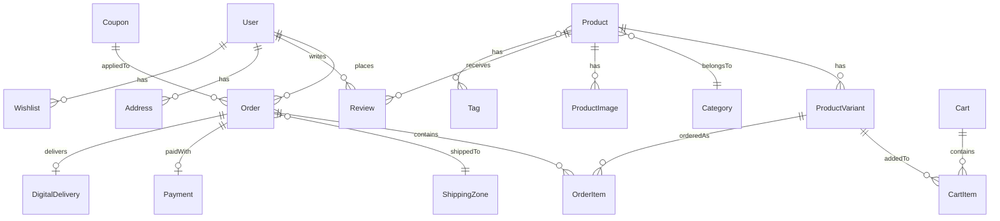

# Data Models & Schema Design

This document outlines the database entities and their relationships for LogaShop.

---

## Entity Relationship Overview



---

## Core Models

### 1. User

```javascript
User {
  _id: ObjectId,
  email: String (unique),
  password: String (hashed),
  name: String,
  role: 'customer' | 'admin' | 'manager' | 'vendor',
  status: 'active' | 'inactive' | 'suspended',
  avatar: String,
  fcmToken: String,
  lastLogin: Date,
  createdAt: Date,
  updatedAt: Date,

  // New e-commerce fields
  phone: String,
  defaultAddressId: ObjectId (ref: Address),

  // Vendor fields (for future multi-vendor)
  vendorProfile: {
    storeName: String,
    storeSlug: String,
    description: String,
    logo: String,
    verified: Boolean,
    commission: Number  // percentage platform takes
  }
}
```

### 2. Address

```javascript
Address {
  _id: ObjectId,
  userId: ObjectId (ref: User, nullable for guest),
  guestEmail: String (for guest checkout),

  type: 'shipping' | 'billing',
  isDefault: Boolean,

  fullName: String,
  phone: String,
  addressLine1: String,
  addressLine2: String,
  city: String,
  state: String,
  postalCode: String,
  country: String (ISO 3166-1 alpha-2),

  createdAt: Date,
  updatedAt: Date
}
```

---

## Product Models

### 3. Category

```javascript
Category {
  _id: ObjectId,
  name: String,
  slug: String (unique),
  description: String,
  image: String,

  parentId: ObjectId (ref: Category, nullable),
  ancestors: [ObjectId] (for efficient hierarchy queries),
  level: Number (0 = root),

  isActive: Boolean,
  sortOrder: Number,

  // SEO
  metaTitle: String,
  metaDescription: String,

  createdAt: Date,
  updatedAt: Date
}
```

### 4. Product

```javascript
Product {
  _id: ObjectId,
  vendorId: ObjectId (ref: User, for multi-vendor ready),

  // Basic Info
  name: String,
  slug: String (unique),
  sku: String (base SKU),
  description: String (rich text),
  shortDescription: String,

  // Type
  productType: 'physical' | 'digital' | 'bundle',

  // Categorization
  categoryId: ObjectId (ref: Category),
  tags: [String],
  brand: String,

  // Pricing (in cents for accuracy)
  basePrice: Number,
  salePrice: Number,
  salePriceStart: Date,
  salePriceEnd: Date,

  // Status
  status: 'draft' | 'active' | 'archived',
  isFeatured: Boolean,

  // Inventory (for simple products without variants)
  trackInventory: Boolean,
  stockQuantity: Number,
  lowStockThreshold: Number,
  allowBackorder: Boolean,

  // Physical product fields
  weight: Number (grams),
  dimensions: {
    length: Number,
    width: Number,
    height: Number,
    unit: 'cm' | 'in'
  },

  // Digital product fields
  digitalFile: {
    url: String,
    fileName: String,
    fileSize: Number,
    downloadLimit: Number,
    expiryDays: Number
  },

  // Attributes (for variants)
  attributes: [{
    name: String,      // "Color", "Size"
    values: [String]   // ["Red", "Blue"], ["S", "M", "L"]
  }],

  // SEO
  metaTitle: String,
  metaDescription: String,

  // Stats
  totalSold: Number,
  averageRating: Number,
  reviewCount: Number,

  createdAt: Date,
  updatedAt: Date
}
```

### 5. ProductVariant

```javascript
ProductVariant {
  _id: ObjectId,
  productId: ObjectId (ref: Product),

  sku: String (unique),

  // Variant attributes (e.g., { color: "Red", size: "M" })
  attributes: Object,

  // Override pricing
  price: Number (null = use product basePrice),
  salePrice: Number,

  // Inventory
  stockQuantity: Number,

  // Override weight (for physical)
  weight: Number,

  // Image specific to this variant
  image: String,

  isActive: Boolean,

  createdAt: Date,
  updatedAt: Date
}
```

### 6. ProductImage

```javascript
ProductImage {
  _id: ObjectId,
  productId: ObjectId (ref: Product),

  url: String,
  alt: String,
  sortOrder: Number,
  isPrimary: Boolean,

  createdAt: Date
}
```

---

## Order Models

### 7. Cart

```javascript
Cart {
  _id: ObjectId,

  // Either userId OR sessionId (for guest)
  userId: ObjectId (ref: User, nullable),
  sessionId: String (for guest carts),

  items: [{
    productId: ObjectId (ref: Product),
    variantId: ObjectId (ref: ProductVariant, nullable),
    quantity: Number,
    priceAtAdd: Number (snapshot price when added)
  }],

  couponCode: String,

  expiresAt: Date (for abandoned cart cleanup),

  createdAt: Date,
  updatedAt: Date
}
```

### 8. Order

```javascript
Order {
  _id: ObjectId,
  orderNumber: String (unique, e.g., "LS-A1B2C3"),

  // Customer
  userId: ObjectId (ref: User, nullable for guest),
  guestEmail: String,
  guestTrackingCode: String (for guest order lookup),

  // Vendor (for multi-vendor ready)
  vendorId: ObjectId (ref: User),

  // Status
  status: 'pending' | 'confirmed' | 'processing' | 'shipped' | 'delivered' | 'cancelled' | 'refunded',
  paymentStatus: 'pending' | 'paid' | 'failed' | 'refunded',

  // Items
  items: [{
    productId: ObjectId,
    variantId: ObjectId,
    name: String (snapshot),
    sku: String (snapshot),
    quantity: Number,
    unitPrice: Number,
    totalPrice: Number,
    productType: 'physical' | 'digital'
  }],

  // Addresses (embedded snapshots)
  shippingAddress: { ...Address fields },
  billingAddress: { ...Address fields },

  // Pricing
  subtotal: Number,
  shippingCost: Number,
  taxAmount: Number,
  discountAmount: Number,
  total: Number,
  currency: 'USD' | 'EUR',

  // Shipping
  shippingZoneId: ObjectId (ref: ShippingZone),
  shippingMethod: String,
  trackingNumber: String,
  estimatedDelivery: Date,

  // Coupon
  couponCode: String,
  couponDiscount: Number,

  // Notes
  customerNote: String,
  adminNote: String,

  // Timestamps
  paidAt: Date,
  shippedAt: Date,
  deliveredAt: Date,
  cancelledAt: Date,

  createdAt: Date,
  updatedAt: Date
}
```

### 9. Payment

```javascript
Payment {
  _id: ObjectId,
  orderId: ObjectId (ref: Order),

  gateway: 'stripe' | 'zarinpal',

  // Gateway-specific
  stripePaymentIntentId: String,
  stripeChargeId: String,

  amount: Number,
  currency: String,
  status: 'pending' | 'succeeded' | 'failed' | 'refunded',

  refundedAmount: Number,
  refundReason: String,

  metadata: Object (gateway response),

  createdAt: Date,
  updatedAt: Date
}
```

### 10. DigitalDelivery

```javascript
DigitalDelivery {
  _id: ObjectId,
  orderId: ObjectId (ref: Order),
  orderItemIndex: Number,

  // Download tracking
  downloadToken: String (unique, secure),
  downloadUrl: String,
  downloadCount: Number,
  maxDownloads: Number,
  expiresAt: Date,

  // For license keys
  licenseKey: String,

  createdAt: Date
}
```

---

## Shipping & Tax

### 11. ShippingZone

```javascript
ShippingZone {
  _id: ObjectId,

  name: String,
  countries: [String] (ISO codes),

  // Flat rate (Phase 1)
  flatRate: Number,
  freeShippingThreshold: Number,

  // Future: weight-based rates
  weightRates: [{
    minWeight: Number,
    maxWeight: Number,
    rate: Number
  }],

  estimatedDays: { min: Number, max: Number },

  isActive: Boolean,

  createdAt: Date,
  updatedAt: Date
}
```

### 12. TaxRate (Future)

```javascript
TaxRate {
  _id: ObjectId,

  name: String,
  country: String,
  state: String,
  rate: Number (percentage),

  isCompound: Boolean,
  isActive: Boolean,

  createdAt: Date,
  updatedAt: Date
}
```

---

## Promotions

### 13. Coupon

```javascript
Coupon {
  _id: ObjectId,

  code: String (unique, uppercase),
  description: String,

  type: 'percentage' | 'fixed' | 'free_shipping',
  value: Number,

  // Limits
  minOrderAmount: Number,
  maxDiscountAmount: Number,
  usageLimit: Number,
  usageLimitPerUser: Number,
  usedCount: Number,

  // Validity
  startDate: Date,
  endDate: Date,
  isActive: Boolean,

  // Restrictions
  applicableProducts: [ObjectId],
  applicableCategories: [ObjectId],
  excludedProducts: [ObjectId],

  createdAt: Date,
  updatedAt: Date
}
```

---

## Reviews & Wishlist

### 14. Review

```javascript
Review {
  _id: ObjectId,

  productId: ObjectId (ref: Product),
  userId: ObjectId (ref: User),
  orderId: ObjectId (ref: Order, verify purchase),

  rating: Number (1-5),
  title: String,
  content: String,

  isVerifiedPurchase: Boolean,
  status: 'pending' | 'approved' | 'rejected',

  helpfulCount: Number,

  adminReply: String,
  adminReplyAt: Date,

  createdAt: Date,
  updatedAt: Date
}
```

### 15. Wishlist

```javascript
Wishlist {
  _id: ObjectId,
  userId: ObjectId (ref: User),

  items: [{
    productId: ObjectId (ref: Product),
    addedAt: Date
  }],

  createdAt: Date,
  updatedAt: Date
}
```

---

## Indexes Strategy

```javascript
// Performance indexes to add
Product: { slug: 1 }, { categoryId: 1, status: 1 }, { vendorId: 1 }
ProductVariant: { productId: 1 }, { sku: 1 }
Order: { userId: 1 }, { guestTrackingCode: 1 }, { orderNumber: 1 }, { status: 1, createdAt: -1 }
Category: { slug: 1 }, { parentId: 1 }
Cart: { userId: 1 }, { sessionId: 1 }, { expiresAt: 1 } (TTL index)
Review: { productId: 1, status: 1 }
```

---

## Notes

1. **All prices stored in cents** (e.g., $19.99 = 1999)
2. **Soft delete** where needed via `deletedAt` field
3. **Timestamps** via Mongoose `timestamps: true`
4. **vendorId** included from start for multi-vendor readiness
